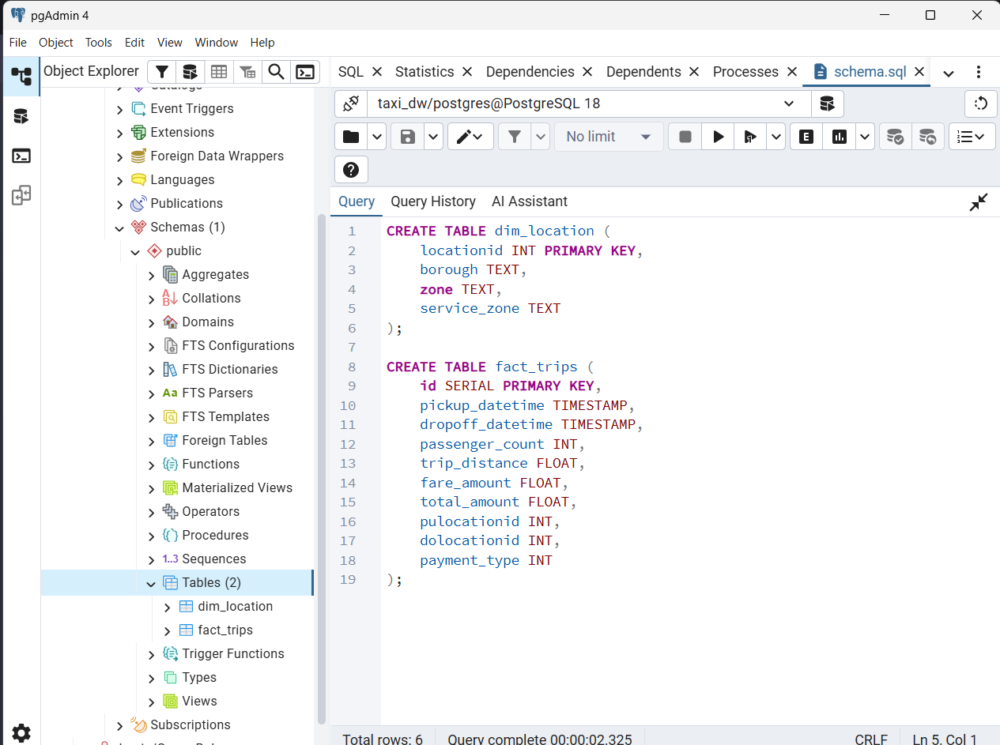
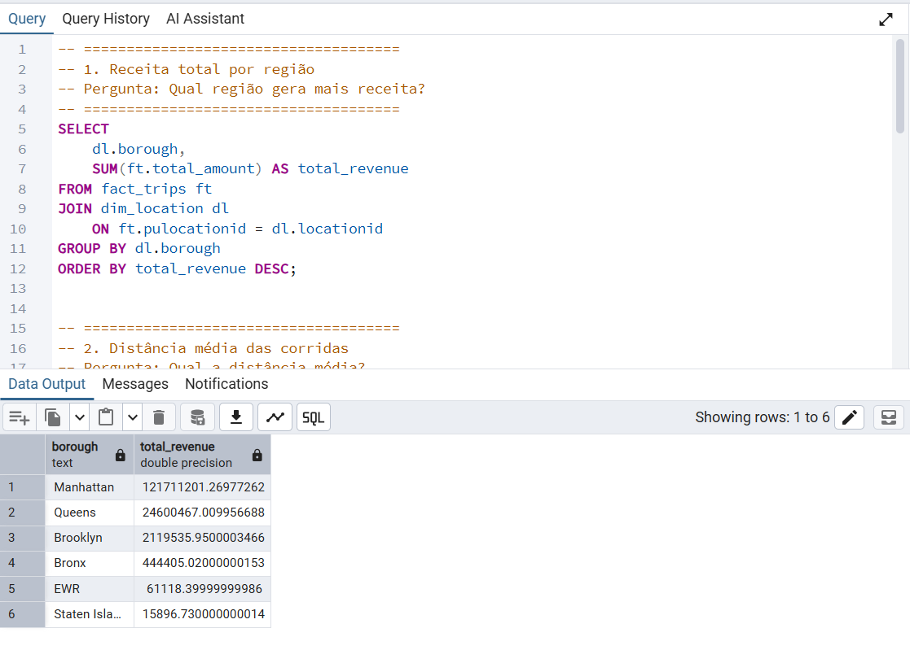
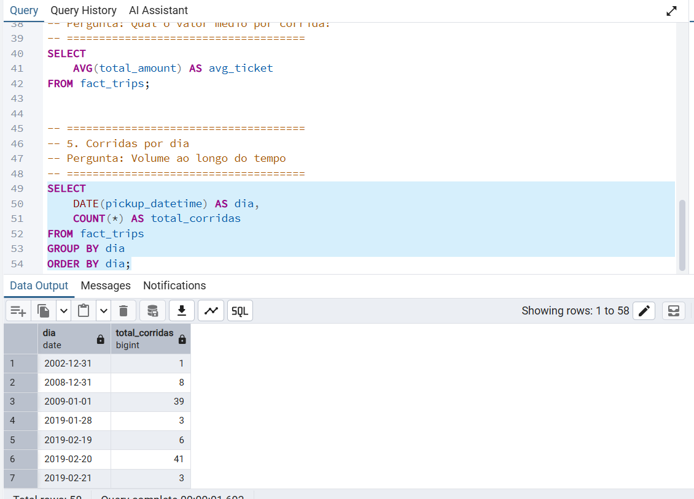
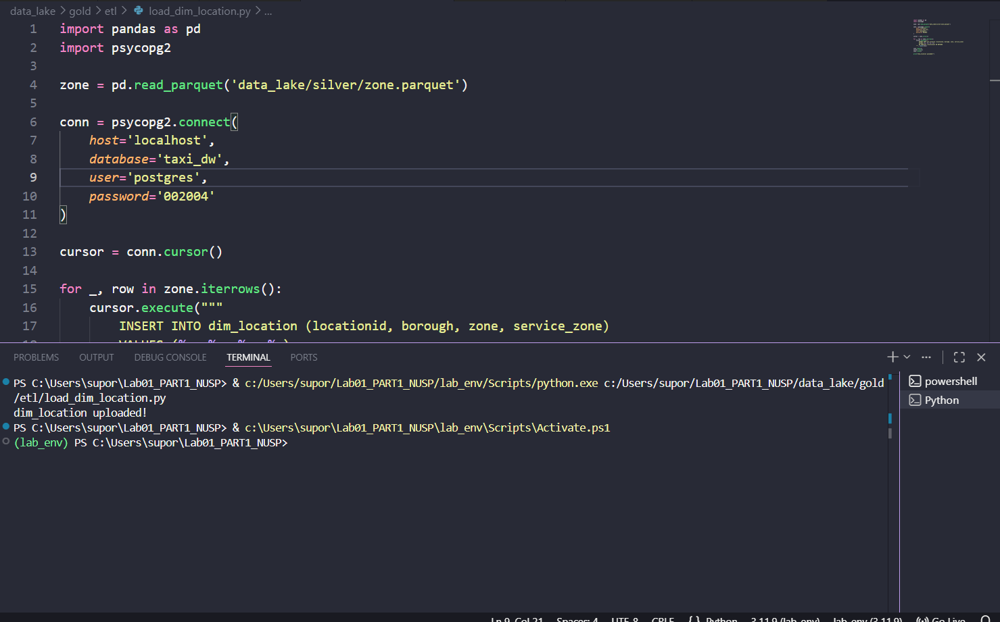
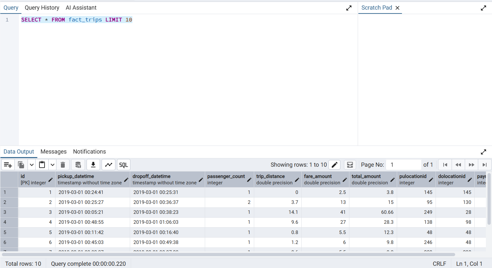

# Pipeline de Engenharia de Dados - Taxi

## 1. Fonte dos Dados

Os dados utilizados neste projeto estão disponíveis no Kaggle: https://www.kaggle.com/datasets/microize/newyork-yellow-taxi-trip-data-2020-2019

### Como utilizar

1. Baixe os arquivos no link acima
2. Insira o arquivo zip na pasta mãe do projeto
3. Execute o arquivo ingest.py

## 2. Arquitetura

O projeto segue a arquitetura em camadas:

**Kaggle (Fonte) → Python (Bronze) → Parquet (Silver) → PostgreSQL (Gold)**

### Fluxo:

1. Ingestão de dados brutos (Bronze)
2. Tratamento e padronização com Python (Silver)
3. Armazenamento em formato Parquet
4. Carga para Data Warehouse no PostgreSQL (Gold)
5. Execução de queries analíticas

---

## 3. Etapas do Projeto

### Bronze

* Ingestão de dados brutos
* Armazenamento sem tratamento

### Silver

* Limpeza de dados
* Padronização de colunas (lowercase, snake_case)
* Remoção de inconsistências
* Exportação em formato `.parquet`

### Gold

* Modelagem dimensional (Star Schema simplificado)
* Criação das tabelas:

  * `fact_trips`
  * `dim_location`
* Carga de dados via Python utilizando `COPY`
* Execução de queries analíticas

---

## Evidências (prints)











---

## 4. Dicionário de Dados

### fact_trips

| Coluna           | Descrição                        |
| ---------------- | -------------------------------- |
| pickup_datetime  | Data e hora de início da corrida |
| dropoff_datetime | Data e hora de término           |
| passenger_count  | Número de passageiros            |
| trip_distance    | Distância da corrida             |
| fare_amount      | Valor da tarifa                  |
| total_amount     | Valor total pago                 |
| pulocationid     | ID da localização de origem      |
| dolocationid     | ID da localização de destino     |
| payment_type     | Tipo de pagamento                |

---

### dim_location

| Coluna       | Descrição                |
| ------------ | ------------------------ |
| locationid   | ID da localização        |
| borough      | Região (bairro/distrito) |
| zone         | Zona específica          |
| service_zone | Tipo de zona de serviço  |

---

## 5. Qualidade de Dados

Durante o processamento foram identificados os seguintes pontos:

* Padronização de colunas necessária (nomes inconsistentes)
* Possíveis valores nulos em colunas como `passenger_count`
* Necessidade de normalização de nomes (ex: `PULocationID` → `pulocationid`)
* Remoção de caracteres especiais nos nomes das colunas

---

## 6. Instruções de Execução

### Instalação

```bash
pip install -r requirements.txt
```

---

### Ordem de execução

1. Executar ingestão (Bronze)
2. Executar transformação (Silver)
3. Executar carga no banco (Gold)

```bash
python etl_gold.py
```

---

### 🗄️ Banco de Dados

* SGBD: PostgreSQL
* Porta padrão: 5432
* Banco utilizado: `taxi_dw`

---

## Estrutura do Projeto

```
LAB01_PART1_NUSP/
│
├── data_lake/
│   ├── bronze/
│   │   ├── ingest.py
│   │   ├── taxi+_zone_lookup.csv
│   │   └── yellow_tripdata_2019-03.csv
│   │
│   ├── silver/
│   │   ├── clean.py
│   │   ├── loader.py
│   │   ├── profiling.py
│   │   ├── report.py
│   │   ├── plot.py
│   │   ├── save.py
│   │   ├── markdown.py
│   │   ├── tripdata.parquet
│   │   ├── zone.parquet
│   │   ├── plots/
│   │   └── reports/
│   │
│   ├── gold/
│   │   ├── etl/
│   │   │   ├── load_dim_location.py
│   │   │   └── load_fact_trips.py
│   │   ├── schema.sql
│   │   └── queries.sql
│   │
│   ├── docs/
│   │
│   └── logs/
│       └── ingest.log
│
├── requirements.txt
├── README.md
```

---

## Métricas Desenvolvidas

* Receita total por região
* Distância média das corridas
* Volume por tipo de pagamento
* Ticket médio
* Volume de corridas por dia

---

## Tecnologias Utilizadas

* Python
* Pandas
* PostgreSQL
* Parquet
* psycopg2
